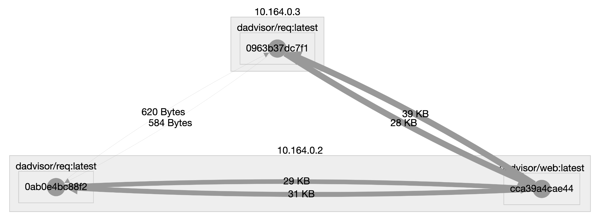

# dAdvisor
A Docker container to inspect inter-container traffic.

Suppose you have a large project with many Docker containers, and you don't know which container interacts with each other.This repository helps you to inspect the traffic between those.

## A small demo
An example docker-compose can be found in the root folder of this project.
It'll boot up a web-service (*web*) and a request-maker (*req*). Use the following command for starting those containers:

	docker run --name web -d dadvisor/web:latest
	docker run --name req -d -e HOST=web:5000 --link web dadvisor/req:latest

## Find out the network traffic
In order to find out the traffic, you'll need the use the following command:

	docker run \
	  --name=dadvisor \
	  --net=host \
	  --volume=/var/run/docker.sock:/var/run/docker.sock \
	  --volume=/var/lib/docker/:/var/lib/docker:ro \
	  --detach=true \
	  dadvisor/dadvisor:latest

## Output
When the containers are up and running, it generates a graph that can be visualized on: [localhost:8800/graph](localhost:8800/graph).

A possible graph for two containers that produces requests and one web-service is shown below.

