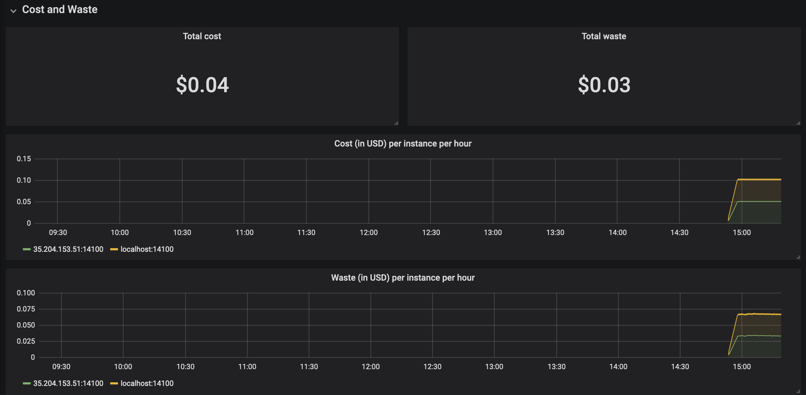

# dAdvisor
A Docker container to inspect your existing Docker Container Distribution.

## Find out the network traffic
In order to run the architecture. You'll need to run the following three types of containers: Root/SuperNode and Node.

### Root

      docker run \
      --name=root \
      --env TYPE=ROOT \
      --detach=true \
      -p 15000:14100 \
      dadvisor/container

### Supernode

      docker run \
      --name=dadvisor \
      --env TYPE=SUPERNODE \
      --detach=true \
      dadvisor/container

### Node

      docker run \
      --name=dadvisor \
      --env TYPE=NODE \
      --detach=true \
      dadvisor/container

### CONFIGURATION OPTIONS
The following options can be configured, by setting the environment variable:

- `DADVISOR_PORT`: port on which the dAdvisor run. Default `14100`.
- `TRACKER`: address for the tracker, which can be used for finding other peers. Default `http://35.204.250.252:14100`.
- `FILTER_PORTS`: comma-separated list of ports that are filtered, so there is no information captured on these ports. Default: `22,14101,DADVISOR_PORT`.
- `TRAFFIC_SAMPLE`: Amount of lines that are captured before sleeping. Default: `1000`.
- `TRAFFIC_K`: If `TRAFFIC_SAMPLE` packets are collected in X seconds, than after these X seconds, the program sleeps for `K*X` seconds. Therefore, increasing `K` leads to a better performance, but a decrease in accuracy. Default: `9`.
- `TRAFFIC_SLEEP_MIN` and `TRAFFIC_SLEEP_MAX`. Lower- and upperbound for sleeping times.  
- `IP`: IP used for communicating with other hosts. Default: `socket.gethostbyname(socket.gethostname())`.
- `INFO_HASH`: the info-hash must be unique per p2p system and is used to find other peers. Default: `abc1234567890`.
- `LOG_LEVEL`: Filter for which level logs are received. Default `ERROR`.

## Output
When the containers are up and running, it generates the output on one of the Grafana dashboard.
Visit the following link for redirecting to this dashboard: [localhost:14100/dadvisor/dashboard](http://localhost:14100/dadvisor/dashboard).

## Grafana
By default, the credentials for Grafana are *username* `admin` and *password* `A2avyaFZCr`.

## Dashboard example

